# Colonees

**The Autonomous Agent Swarm Platform**

Colonees is an open-source, production-grade autonomous agent swarm platform. It orchestrates a superagent with an extensible colony of specialist agents — each with its own tools, memory, constraints, and evaluation criteria — to execute complex, multi-step workflows end-to-end without human-in-the-loop bottlenecks.

The platform is **domain-agnostic** and **embeddable** — deployed with specialist agents across any vertical including healthcare, finance, legal, education, media, government, trade, logistics, research, and enterprise operations. Designed for any organisation seeking to run complex, autonomous workflows at scale without human-in-the-loop bottlenecks. Drop it into any product as a plug-and-play intelligence layer. Specialists can be created, configured, and managed entirely through the API, making dynamic agent creation a first-class feature.

---

## Architecture

### Full System Flow (Mermaid)

```mermaid
flowchart TD
    %% ── Client Layer ──────────────────────────────────────────────────────
    CLIENT(["Client\nREST · CLI · SDK"])

    %% ── FastAPI App ────────────────────────────────────────────────────────
    subgraph APP["app.py  —  FastAPI"]
        INVOKE["/invoke\nPOST"]
        HISTORY_GET["/history/{session_id}\nGET"]
        HISTORY_DEL["/history/{session_id}\nDELETE"]
        COLONEES_API["/colonees  CRUD\nPOST · GET · PUT · DELETE\nenable · disable"]
        MCP_API["/mcp/servers\nPOST · GET · DELETE"]
        STATUS["/status  /health\nGET"]
    end

    %% ── Platform ───────────────────────────────────────────────────────────
    subgraph PLATFORM["ColoneesPlatform  (platform.py)"]
        P_INIT["initialize()\nboot all components"]
        P_HANDLE["handle_request(goal, context)\n1 resolve session_id\n2 store user turn\n3 call supervisor\n4 store assistant turn\n5 return result"]
        P_STATUS["get_platform_status()"]
        P_SHUTDOWN["shutdown()"]
    end

    %% ── Memory package ─────────────────────────────────────────────────────
    subgraph MEMORY["colon/memory/"]
        subgraph MM["CologeesMemoryManager"]
            MM_STORE["store(session_id, role, content)"]
            MM_GET["get_history(session_id, limit)"]
            MM_CLEAR["clear(session_id)"]
            MM_STATS["get_stats()"]
        end
        subgraph SM["CologeesSessionManager"]
            SM_CREATE["create_session(context)\n→ session_id"]
            SM_CLEANUP["cleanup_session(session_id)"]
            SM_EXPIRE["_periodic_cleanup()\nbackground loop"]
            SM_SHUTDOWN["shutdown()"]
        end
        subgraph SSM["ColoneesStrandsSessionManager"]
            SSM_INIT["initialize(agent)\nschedule _restore()"]
            SSM_RESTORE["_restore(agent)\nload messages + state"]
            SSM_APPEND["append_message(msg, agent)\nfire-and-forget persist"]
            SSM_SYNC["sync_agent(agent)\nreplace state snapshot"]
            SSM_REDACT["redact_latest_message()"]
            SSM_CLEAR["clear()\ndelete msg + state keys"]
        end
        subgraph BACKEND["MemoryBackend  (shared store)"]
            B_KEY1["key: {session_id}\nhuman-readable turns"]
            B_KEY2["key: strands:msg:{session_id}\nraw LLM messages array"]
            B_KEY3["key: strands:state:{session_id}\nagent state snapshot"]
        end
    end

    %% ── Supervisor ─────────────────────────────────────────────────────────
    subgraph SUPERVISOR["ColoneesSupervisorAgent  (workflow_orchestrator.py)"]
        SUP_AGENT["Strands Agent\ncolonees_superagent\nsession_manager=SSM_supervisor"]
        subgraph SUP_TOOLS["Supervisor Tools  (@tool)"]
            T_ANALYZE["analyze_goal()\nextract capabilities"]
            T_DISCOVER["discover_agents_for_capabilities()\nquery AgentDirectory"]
            T_SPAWN["spawn_agent(type, specialization)\ncreate specialist"]
            T_SEND["send_task_to_agent(agent_id, task)\ninvoke specialist"]
            T_SYNTH["synthesize_results(results)\ncombine outputs"]
            T_SAFETY["monitor_execution_safety()\ncheck limits"]
            T_STATUS["get_agent_status()"]
            T_LIST["list_active_agents()"]
            T_CAPS["get_agent_capabilities()"]
        end
        SUP_EXTRACT["_extract_final_asset(result)\nparse FINAL_RESPONSE block"]
        SUP_SAFETY["Safety limits\n20 steps · 30 tools\n5 recursion · 10 min · 10 agents"]
        SUP_ALLOWLIST["colonee_allowlist\nper-request filter"]
    end

    %% ── Agent Manager ──────────────────────────────────────────────────────
    subgraph AGENTMGR["CologeesAgentManager  (agent_manager.py)"]
        AM_CREATE["create_specialist_agent(\n  type, specialization, session_id)"]
        AM_REGISTRY["active_specialist_agents\nDict[agent_id → agent]"]
        AM_CAPS["specialist_capabilities\ncapability → colonee type map"]
        AM_SYNC["_sync_capabilities_from_registry()"]
        AM_CLEANUP["cleanup_agent(agent_id)"]
        AM_DIR["_register_specialist_in_directory()"]
    end

    %% ── Colonee Registry ───────────────────────────────────────────────────
    subgraph REGISTRY["ColoneeRegistry  (colonee_registry.py)"]
        REG_BUILTINS["Built-in colonees\nresearcher · domain_expert\nanalyst · executor · media_producer"]
        REG_USER["User-defined colonees\nvia POST /colonees"]
        REG_PERSIST["JSON persistence\ncolonees_files/colonee_registry.json"]
        REG_GET["get(name) → ColoneeDefinition"]
        REG_LIST["list(enabled_only, tags)"]
        REG_CRUD["create · update · delete\nenable · disable"]
    end

    %% ── Specialist Factory ─────────────────────────────────────────────────
    subgraph FACTORY["SpecialistAgentFactory  (specialist_agents.py)"]
        FAC_CREATE["create_specialist_agent()\n1 registry.get(type)\n2 DynamicSpecialistAgent(defn)"]
    end

    %% ── Dynamic Specialist ─────────────────────────────────────────────────
    subgraph DYNSPEC["DynamicSpecialistAgent  (dynamic_specialist.py)"]
        DS_AGENT["Strands Agent\nname=agent_id\nsession_manager=SSM_specialist"]
        DS_PROMPT["system_prompt\nfrom definition\n+ constraint appendix"]
        DS_TOOLS["_create_agent()\nassemble tools from definition"]
        subgraph DS_TOOLSETS["Tool sets  (built_in_tools)"]
            DS_FILE["file\nFileToolProvider"]
            DS_MEDIA["media\nMediaToolProvider"]
            DS_RESEARCH["research\nget_research_tools()"]
            DS_COMPUTE["computation\nget_computation_tools()"]
        end
        DS_MCP["_extra_tools()\nMCPManager.get_tools(server)\nor get_tools_for_specialist(type)"]
    end

    %% ── Tool Providers ─────────────────────────────────────────────────────
    subgraph TOOLS["Tool Providers"]
        subgraph FTP["FileToolProvider"]
            FTP_OPS["read · write · append · delete\ncopy · move · list · exists\nmetadata · search · replace\nread_lines · create_folder\ndelete_folder · get_public_url"]
        end
        subgraph MTP["MediaToolProvider"]
            MTP_OPS["create_production · write_script\nsanitize_image_prompt · generate_image\nresize_image · text_to_speech\nassemble_video · save_to_disk\nload_from_disk · list_artifacts\ndelete_artifact · get_production_info"]
        end
        subgraph RTP["ResearchTools"]
            RTP_OPS["web_search · fetch_url\nparse_content · summarise"]
        end
        subgraph CTP["ComputeTools"]
            CTP_OPS["python_exec · math_eval\ncalculate · code_interpret"]
        end
    end

    %% ── MCP Manager ────────────────────────────────────────────────────────
    subgraph MCPMGR["MCPManager  (mcp_manager.py)"]
        MCP_ADD["add_server(name, transport, url,\nheaders, command, args, env,\nspecialist_types)"]
        MCP_TOOLS["get_tools(server_name)\nget_tools_for_specialist(type)"]
        MCP_LIST["list_servers()"]
        MCP_REMOVE["remove_server(name)"]
        MCP_TRANSPORTS["Transports:\nstreamable_http · sse · stdio"]
    end

    %% ── Agent Directory ────────────────────────────────────────────────────
    subgraph AGENTDIR["AgentDirectory  (agent_directory.py)"]
        AD_REG["register_agent(metadata)"]
        AD_FIND["find_agents_by_capabilities()"]
        AD_SELECT["select_optimal_agent()"]
    end

    %% ── Resource Manager ───────────────────────────────────────────────────
    subgraph RESMGR["CologeesResourceManager  (resource_manager.py)"]
        RM_MONITOR["monitor resource usage\nCPU · memory · sessions"]
        RM_STATS["get_resource_stats()"]
    end

    %% ═══════════════════════════════════════════════════════════════════════
    %% Edges — Client → App
    %% ═══════════════════════════════════════════════════════════════════════
    CLIENT -->|"POST /invoke"| INVOKE
    CLIENT -->|"GET /history"| HISTORY_GET
    CLIENT -->|"DELETE /history"| HISTORY_DEL
    CLIENT -->|"CRUD"| COLONEES_API
    CLIENT -->|"register/list/remove"| MCP_API
    CLIENT -->|"GET"| STATUS

    %% App → Platform
    INVOKE --> P_HANDLE
    HISTORY_GET --> MM_GET
    HISTORY_DEL --> MM_CLEAR
    HISTORY_DEL --> SSM_CLEAR
    COLONEES_API --> REG_CRUD
    MCP_API --> MCP_ADD
    MCP_API --> MCP_LIST
    MCP_API --> MCP_REMOVE
    STATUS --> P_STATUS
    P_STATUS --> RM_STATS
    P_STATUS --> MM_STATS

    %% Platform init
    P_INIT --> SM_CREATE
    P_INIT --> MM_STORE
    SM_CREATE -->|"supervisor session_id"| SSM_INIT
    SSM_INIT --> SSM_RESTORE

    %% Platform handle_request
    P_HANDLE --> MM_STORE
    P_HANDLE --> SUP_AGENT
    P_HANDLE -->|"store assistant turn"| MM_STORE

    %% Memory → Backend
    MM_STORE --> B_KEY1
    MM_GET --> B_KEY1
    MM_CLEAR --> B_KEY1
    SSM_APPEND --> B_KEY2
    SSM_RESTORE --> B_KEY2
    SSM_RESTORE --> B_KEY3
    SSM_SYNC --> B_KEY3
    SSM_CLEAR --> B_KEY2
    SSM_CLEAR --> B_KEY3

    %% Supervisor internal
    SUP_AGENT --> T_ANALYZE
    SUP_AGENT --> T_DISCOVER
    SUP_AGENT --> T_SPAWN
    SUP_AGENT --> T_SEND
    SUP_AGENT --> T_SYNTH
    SUP_AGENT --> T_SAFETY
    SUP_AGENT --> T_STATUS
    SUP_AGENT --> T_LIST
    SUP_AGENT --> T_CAPS
    SUP_AGENT --> SUP_EXTRACT
    SUP_AGENT --> SUP_SAFETY
    SUP_AGENT --> SUP_ALLOWLIST
    SUP_AGENT -->|"Strands hooks"| SSM_APPEND
    SUP_AGENT -->|"after invocation"| SSM_SYNC

    %% Supervisor tools → downstream
    T_DISCOVER --> AD_FIND
    T_DISCOVER --> AD_SELECT
    T_SPAWN --> SM_CREATE
    T_SPAWN --> AM_CREATE
    T_SEND --> AM_REGISTRY
    T_CAPS --> REG_GET

    %% Cleanup in finally
    T_SPAWN -->|"finally: cleanup"| SM_CLEANUP

    %% Agent Manager
    AM_CREATE --> FAC_CREATE
    AM_CREATE --> SSM_INIT
    AM_CREATE --> AM_DIR
    AM_DIR --> AD_REG
    AM_SYNC --> REG_LIST
    AM_CAPS --> REG_LIST

    %% Factory → Dynamic Specialist
    FAC_CREATE --> REG_GET
    FAC_CREATE --> DYNSPEC

    %% Dynamic Specialist assembly
    DS_TOOLS --> DS_FILE
    DS_TOOLS --> DS_MEDIA
    DS_TOOLS --> DS_RESEARCH
    DS_TOOLS --> DS_COMPUTE
    DS_TOOLS --> DS_MCP
    DS_FILE --> FTP_OPS
    DS_MEDIA --> MTP_OPS
    DS_RESEARCH --> RTP_OPS
    DS_COMPUTE --> CTP_OPS
    DS_MCP --> MCP_TOOLS
    DS_AGENT -->|"Strands hooks"| SSM_APPEND
    DS_AGENT -->|"after invocation"| SSM_SYNC

    %% MCP
    MCP_ADD --> MCP_TRANSPORTS
    MCP_TOOLS --> MCP_TRANSPORTS

    %% Platform shutdown
    P_SHUTDOWN --> SM_SHUTDOWN
    P_SHUTDOWN --> RM_MONITOR

    %% Registry persistence
    REG_CRUD --> REG_PERSIST
    REG_BUILTINS --> REG_GET
    REG_USER --> REG_GET

    %% Styling
    classDef client fill:#1a1a2e,stroke:#e94560,color:#fff
    classDef app fill:#16213e,stroke:#0f3460,color:#fff
    classDef platform fill:#0f3460,stroke:#533483,color:#fff
    classDef memory fill:#533483,stroke:#e94560,color:#fff
    classDef supervisor fill:#e94560,stroke:#fff,color:#fff
    classDef agentmgr fill:#1a1a2e,stroke:#533483,color:#fff
    classDef registry fill:#0f3460,stroke:#e94560,color:#fff
    classDef specialist fill:#16213e,stroke:#533483,color:#fff
    classDef tools fill:#1a1a2e,stroke:#0f3460,color:#fff
    classDef mcp fill:#533483,stroke:#0f3460,color:#fff
    classDef infra fill:#0d0d0d,stroke:#333,color:#aaa

    class CLIENT client
    class INVOKE,HISTORY_GET,HISTORY_DEL,COLONEES_API,MCP_API,STATUS app
    class P_INIT,P_HANDLE,P_STATUS,P_SHUTDOWN platform
    class MM_STORE,MM_GET,MM_CLEAR,MM_STATS,SM_CREATE,SM_CLEANUP,SM_EXPIRE,SM_SHUTDOWN,SSM_INIT,SSM_RESTORE,SSM_APPEND,SSM_SYNC,SSM_REDACT,SSM_CLEAR,B_KEY1,B_KEY2,B_KEY3 memory
    class SUP_AGENT,T_ANALYZE,T_DISCOVER,T_SPAWN,T_SEND,T_SYNTH,T_SAFETY,T_STATUS,T_LIST,T_CAPS,SUP_EXTRACT,SUP_SAFETY,SUP_ALLOWLIST supervisor
    class AM_CREATE,AM_REGISTRY,AM_CAPS,AM_SYNC,AM_CLEANUP,AM_DIR agentmgr
    class REG_BUILTINS,REG_USER,REG_PERSIST,REG_GET,REG_LIST,REG_CRUD registry
    class FAC_CREATE,DS_AGENT,DS_PROMPT,DS_TOOLS,DS_FILE,DS_MEDIA,DS_RESEARCH,DS_COMPUTE,DS_MCP specialist
    class FTP_OPS,MTP_OPS,RTP_OPS,CTP_OPS tools
    class MCP_ADD,MCP_TOOLS,MCP_LIST,MCP_REMOVE,MCP_TRANSPORTS mcp
    class AD_REG,AD_FIND,AD_SELECT,RM_MONITOR,RM_STATS infra
```



---

### Full System Flow (ASCII)

```
                        ┌─────────────────────────────────────────┐
                        │            CLIENT / CALLER               │
                        │   REST API  ·  CLI  ·  Embedded SDK     │
                        └──────────────────┬──────────────────────┘
                                           │  POST /invoke
                                           │  { goal, session_id?, colonees? }
                                           ▼
┌──────────────────────────────────────────────────────────────────────────────┐
│                          ColoneesPlatform                                    │
│                                                                              │
│  1. Resolve session_id (caller-supplied or auto-generated request key)       │
│  2. Store user turn → MemoryManager (human-readable history)                 │
│  3. Delegate to ColoneesSupervisorAgent.handle_request()                     │
│  4. Store assistant response → MemoryManager                                 │
│  5. Return { status, response, session_id, task_id, final_asset, ... }       │
└──────────────────────────────────────────────────────────────────────────────┘
                                           │
                                           ▼
┌──────────────────────────────────────────────────────────────────────────────┐
│                     ColoneesSupervisorAgent  (Strands Agent)                 │
│                                                                              │
│  Autonomous orchestration — LLM decides when to call each tool               │
│                                                                              │
│  Tools available to the supervisor:                                          │
│  ┌─────────────────────────────────────────────────────────────────────┐    │
│  │  analyze_goal          → extract required capabilities from goal    │    │
│  │  discover_agents       → query AgentDirectory for existing agents   │    │
│  │  spawn_agent           → create a new specialist via AgentManager   │    │
│  │  send_task_to_agent    → invoke a specialist with a sub-task        │    │
│  │  synthesize_results    → combine specialist outputs                 │    │
│  │  monitor_execution_safety → check step/tool/time/agent limits       │    │
│  │  get_agent_status      → check if a specialist is active            │    │
│  │  list_active_agents    → enumerate running specialists              │    │
│  │  get_agent_capabilities → query colonee capability map              │    │
│  └─────────────────────────────────────────────────────────────────────┘    │
│                                                                              │
│  Safety limits: 20 steps · 30 tool calls · 5 recursion · 10 min · 10 agents │
│  Colonee allowlist: per-request restriction on which specialists may spawn   │
│                                                                              │
│  ColoneesStrandsSessionManager (supervisor)                                  │
│  → persists supervisor LLM messages + state across all requests              │
└──────────────────────────────────────────────────────────────────────────────┘
                    │ spawn_agent                    │ send_task_to_agent
                    ▼                                ▼
┌───────────────────────────────┐    ┌───────────────────────────────────────┐
│      CologeesAgentManager     │    │     DynamicSpecialistAgent             │
│                               │    │     (Strands Agent)                    │
│  1. Mint session ID via        │    │                                       │
│     CologeesSessionManager    │    │  Driven entirely by ColoneeDefinition: │
│  2. Create                    │    │  · system_prompt (+ constraints)       │
│     ColoneesStrandsSession    │    │  · built_in_tools (file/compute/       │
│     Manager(session_id,       │    │    research/media)                     │
│     backend)                  │    │  · mcp_servers (scoped MCP tools)      │
│  3. Instantiate               │    │  · capabilities list                   │
│     DynamicSpecialistAgent    │    │                                        │
│  4. Register in AgentDirectory│    │  ColoneesStrandsSessionManager         │
│                               │    │  (specialist, per-task session_id)     │
└───────────────────────────────┘    │  → persists specialist LLM messages   │
                                     └───────────────────────────────────────┘
                                                      │
                                     ┌────────────────┼────────────────┐
                                     ▼                ▼                ▼
                             ┌──────────────┐ ┌──────────────┐ ┌──────────────┐
                             │ FileToolProv │ │ MediaToolProv│ │  MCP Server  │
                             │ read / write │ │ image / tts  │ │  (external)  │
                             │ list / copy  │ │ video / audio│ │  any tools   │
                             └──────────────┘ └──────────────┘ └──────────────┘
                             ┌──────────────┐ ┌──────────────┐
                             │ ResearchTools│ │ ComputeTools │
                             │ web search   │ │ python / math│
                             │ fetch / parse│ │ calculations │
                             └──────────────┘ └──────────────┘
```

---

### Memory & Session Architecture

```
                    ┌─────────────────────────────────────────────┐
                    │           InProcessMemoryBackend             │
                    │   (swap for Redis / Postgres / DynamoDB)     │
                    │                                              │
                    │  key: {session_id}                           │
                    │    → human-readable turns                    │
                    │      { role, content, timestamp, metadata }  │
                    │    → written by CologeesMemoryManager        │
                    │    → read by GET /history/{session_id}       │
                    │                                              │
                    │  key: strands:msg:{session_id}               │
                    │    → raw Strands messages array              │
                    │    → written by ColoneesStrandsSession       │
                    │      Manager.append_message()                │
                    │    → restored on agent init                  │
                    │                                              │
                    │  key: strands:state:{session_id}             │
                    │    → agent state snapshot (latest only)      │
                    │    → written by sync_agent() after each call │
                    │    → restored on agent init                  │
                    └─────────────────────────────────────────────┘
                         ▲                        ▲
                         │                        │
          ┌──────────────┴──────┐    ┌────────────┴──────────────┐
          │ CologeesMemoryMgr   │    │ ColoneesStrandsSession     │
          │                     │    │ Manager                    │
          │ store(session_id,   │    │                            │
          │   role, content)    │    │ Strands SessionManager     │
          │ get_history(...)    │    │ protocol implementation:   │
          │ clear(session_id)   │    │ · initialize() → restore   │
          │                     │    │ · append_message() → save  │
          │ Used by:            │    │ · sync_agent() → snapshot  │
          │ · platform on every │    │ · redact_latest_message()  │
          │   request in/out    │    │                            │
          │ · GET /history      │    │ One instance per agent:    │
          │ · DELETE /history   │    │ · supervisor (permanent)   │
          └─────────────────────┘    │ · each specialist (per     │
                                     │   task, cleaned up after)  │
                                     └────────────────────────────┘

          ┌─────────────────────────────────────────────────────┐
          │ CologeesSessionManager                              │
          │                                                     │
          │ Tracks session ID lifecycle only — no content       │
          │ · create_session() → mint UUID session ID           │
          │ · cleanup_session() → remove from active dict       │
          │ · background loop → expire timed-out sessions       │
          │                                                     │
          │ Used by:                                            │
          │ · platform init → supervisor session ID             │
          │ · spawn_agent → specialist session ID per task      │
          │ · orchestrator finally → cleanup specialist IDs     │
          └─────────────────────────────────────────────────────┘
```

---

### Colonee Registry & Dynamic Instantiation

```
  POST /colonees                     ColoneeRegistry
  (or built-in defaults)  ────────►  _colonees: Dict[name, ColoneeDefinition]
                                     · persisted to colonees_files/colonee_registry.json
                                     · built-ins cannot be deleted
                                     · user-defined: full CRUD + enable/disable

  spawn_agent("researcher", ...)
         │
         ▼
  SpecialistAgentFactory.create()
         │
         ├── colonee_registry.get("researcher") → ColoneeDefinition
         │
         ▼
  DynamicSpecialistAgent(definition, session_id, ...)
         │
         ├── system_prompt from definition (+ constraint appendix)
         ├── built_in_tools → FileToolProvider / MediaToolProvider /
         │                    ResearchTools / ComputeTools
         ├── mcp_servers → MCPManager.get_tools(server_name)
         │   (if definition.mcp_servers is empty → global specialist-type scoping)
         └── Strands Agent(name, model, session_manager, tools)
```

---

### Request Lifecycle (end to end)

```
  Client sends: POST /invoke { goal: "...", session_id: "abc" }
       │
       ▼
  platform.handle_request()
       ├── memory.store(session_id, role="user", content=goal)
       ├── supervisor.handle_request(goal, context)
       │       │
       │       ▼  supervisor LLM turn begins
       │       ├── analyze_goal()         → extract capabilities
       │       ├── discover_agents()      → check AgentDirectory
       │       ├── spawn_agent("researcher", "market analysis")
       │       │       ├── session_manager.create_session() → sid_1
       │       │       ├── ColoneesStrandsSessionManager(sid_1, backend)
       │       │       └── DynamicSpecialistAgent(definition, sid_1)
       │       ├── send_task_to_agent(agent_id, task)
       │       │       └── specialist LLM turn → uses tools → returns result
       │       ├── synthesize_results([result])
       │       └── returns final response
       │       finally:
       │           session_manager.cleanup_session(sid_1)
       │
       ├── memory.store(session_id, role="assistant", content=response)
       └── return { status, response, session_id, task_id, final_asset }
```

---

### Core Principles

- Superagent orchestrates — never executes tools directly
- Specialists reason and use tools — never orchestrate other agents
- Tool providers execute — no reasoning, no LLM calls
- All specialist types are data-driven (`ColoneeDefinition`) — no Python subclass needed
- One shared `MemoryBackend` for all history (human-readable + Strands LLM state)
- Session IDs are the single key tying memory, Strands state, and session lifecycle together

---

## Quick Start

### Prerequisites

- Python 3.10+
- An LLM API key (Groq, OpenAI, Anthropic, or any OpenAI-compatible provider)
- `GEMINI_API_KEY` for image generation and TTS (media features)

### Installation

```bash
git clone https://github.com/colonees/colonees.git
cd colonees
pip install -e ".[dev]"
cp .env .env.local
# Edit .env.local — set LLM_API_KEY at minimum
```

### Run

```bash
export LLM_API_KEY=your_key_here
python app.py
# API available at http://localhost:8080
# Interactive docs at http://localhost:8080/docs
```

### Docker

```bash
docker build -t colonees .
docker run -p 8080:8080 --env-file .env colonees
```

---

## API Reference

### System

```bash
# Liveness probe
curl http://localhost:8080/health

# Platform status
curl http://localhost:8080/status
```

### Agent Swarm

```bash
# All enabled colonees are available by default
curl -X POST http://localhost:8080/invoke \
  -H "Content-Type: application/json" \
  -d '{
    "goal": "Analyse the competitive landscape for EVs in 2025 and produce a report",
    "context": {}
  }'

# Resume an existing session
curl -X POST http://localhost:8080/invoke \
  -H "Content-Type: application/json" \
  -d '{
    "goal": "Continue the analysis with a focus on European markets",
    "session_id": "session_20250323120000_abc12345"
  }'

# Restrict which colonees the superagent may use for this request
curl -X POST http://localhost:8080/invoke \
  -H "Content-Type: application/json" \
  -d '{
    "goal": "Research and summarise the latest CRISPR breakthroughs",
    "colonees": ["researcher", "analyst"]
  }'

# Invoke a specific specialist directly
curl -X POST http://localhost:8080/agents/invoke \
  -H "Content-Type: application/json" \
  -d '{
    "agent_type": "researcher",
    "task": "Find the latest peer-reviewed papers on CRISPR gene editing",
    "context": {}
  }'

# List registered agents
curl http://localhost:8080/agents
```

**Built-in specialist types:** `domain_expert`, `researcher`, `analyst`, `executor`, `media_producer`

---

### Colonees — Dynamic Specialist Creation

Colonees (specialist definitions) are the platform's key differentiator. Create fully-described specialists via the API — no Python code required.

**Colonee lifecycle:**
- All colonees (built-in and user-defined) have an `enabled` flag
- Disabled colonees cannot be spawned — they are invisible to the superagent
- Use enable/disable to control which specialists are active in your swarm at any time
- Per-request, you can further restrict which colonees the superagent may use via the `colonees` allowlist in `/invoke`

```bash
# Create a custom specialist
curl -X POST http://localhost:8080/colonees \
  -H "Content-Type: application/json" \
  -d '{
    "name": "legal_researcher",
    "display_name": "Legal Researcher",
    "description": "Researches case law, statutes, and legal precedents.",
    "specialist_type": "researcher",
    "system_prompt": "You are a Legal Research Specialist for {specialization}. Use your tools to find relevant case law, statutes, and legal commentary. Always cite sources with URLs.",
    "capabilities": ["legal_research", "case_law_analysis", "statute_interpretation"],
    "built_in_tools": ["research", "file"],
    "mcp_servers": [],
    "constraints": {
      "max_tool_calls": 20,
      "forbidden_topics": ["medical advice", "financial advice"],
      "output_format": "markdown"
    },
    "evaluation": {
      "require_sources": true,
      "quality_threshold": 0.8
    },
    "tags": ["legal", "research"]
  }'

# List all colonees (built-in + user-defined)
curl http://localhost:8080/colonees

# Filter by tag
curl "http://localhost:8080/colonees?tag=legal"

# Filter enabled only
curl "http://localhost:8080/colonees?enabled_only=true"

# Get a specific colonee
curl http://localhost:8080/colonees/legal_researcher

# Update a colonee
curl -X PUT http://localhost:8080/colonees/legal_researcher \
  -H "Content-Type: application/json" \
  -d '{
    "description": "Updated description",
    "constraints": { "max_tool_calls": 30 }
  }'

# Enable / disable (works on built-ins too)
curl -X POST http://localhost:8080/colonees/legal_researcher/enable
curl -X POST http://localhost:8080/colonees/legal_researcher/disable

# Disable a built-in colonee (e.g. remove media_producer from the swarm)
curl -X POST http://localhost:8080/colonees/media_producer/disable

# Delete (user-defined only — built-ins are protected from deletion)
curl -X DELETE http://localhost:8080/colonees/legal_researcher
```

**Per-request colonee selection**

You can restrict which colonees the superagent may spawn for a specific request using the `colonees` field in `/invoke`. This is useful when you want to scope a task to a subset of your swarm — for example, only allowing research and analysis colonees for a data task, or presenting a curated set of specialists to an end user before they submit a request.

```bash
# Only allow researcher and analyst for this request
curl -X POST http://localhost:8080/invoke \
  -H "Content-Type: application/json" \
  -d '{
    "goal": "Analyse the competitive landscape for EVs in 2025 and produce a report",
    "colonees": ["researcher", "analyst"]
  }'

# Omit colonees entirely — all enabled colonees are available (default)
curl -X POST http://localhost:8080/invoke \
  -H "Content-Type: application/json" \
  -d '{
    "goal": "Produce a 2-minute explainer video on quantum computing"
  }'
```

Rules:
- Only enabled colonees can appear in the allowlist — disabled ones are silently filtered out
- If `colonees` is omitted, all enabled colonees are available
- If `colonees` is an empty list, the superagent has no specialists to spawn and will fail gracefully
- Built-in colonees behave identically to user-defined ones — they can be disabled and excluded from requests

**Colonee fields:**

| Field | Description |
|---|---|
| `name` | Unique slug — used to spawn the agent |
| `specialist_type` | Base type: `researcher`, `domain_expert`, `analyst`, `executor`, `media_producer` |
| `system_prompt` | Full system prompt. Use `{specialization}` as a placeholder |
| `built_in_tools` | Tool sets to enable: `file`, `computation`, `research`, `media` |
| `mcp_servers` | Named MCP servers to attach (registered via `/mcp/servers`) |
| `capabilities` | Capability strings — used by the superagent for discovery |
| `constraints` | `max_tool_calls`, `max_runtime_seconds`, `forbidden_topics`, `output_format` |
| `memory` | `enabled`, `strategy` (`basic`/`semantic`/`episodic`), `max_size_mb` |
| `evaluation` | `quality_threshold`, `require_sources`, `require_structured_output`, `custom_criteria` |
| `tags` | Free-form tags for filtering |
| `enabled` | Whether this colonee can be spawned (default `true`) |

**Built-in colonees** (ship with the platform, cannot be deleted, but can be disabled):

| Name | Type | Tools |
|---|---|---|
| `researcher` | researcher | research, computation |
| `domain_expert` | domain_expert | media, computation, research |
| `analyst` | analyst | file, media, computation |
| `executor` | executor | file, media, computation |
| `media_producer` | media_producer | media |

---

### MCP Servers — External Tool Integration

Register external MCP servers to inject tools into specialists at spawn time.

```bash
# HTTP server with API key auth (X-API-Key header)
curl -X POST http://localhost:8080/mcp/servers \
  -H "Content-Type: application/json" \
  -d '{
    "name": "pubmed",
    "transport": "streamable_http",
    "url": "https://pubmed-mcp.example.com/mcp/",
    "headers": { "X-API-Key": "your-api-key-here" },
    "specialist_types": ["researcher"]
  }'

# SSE server with bearer token auth
curl -X POST http://localhost:8080/mcp/servers \
  -H "Content-Type: application/json" \
  -d '{
    "name": "legal_db",
    "transport": "sse",
    "url": "https://legal-mcp.example.com/sse/",
    "headers": { "Authorization": "Bearer eyJ..." },
    "specialist_types": ["analyst", "researcher"]
  }'

# stdio server — secrets passed as env vars to the server process
curl -X POST http://localhost:8080/mcp/servers \
  -H "Content-Type: application/json" \
  -d '{
    "name": "postgres",
    "transport": "stdio",
    "command": "python",
    "args": ["db_server.py"],
    "env": { "DB_PASSWORD": "secret", "DB_HOST": "localhost" },
    "specialist_types": ["analyst", "researcher"]
  }'

# Register a server available to ALL specialists (omit specialist_types)
curl -X POST http://localhost:8080/mcp/servers \
  -H "Content-Type: application/json" \
  -d '{
    "name": "logging",
    "transport": "streamable_http",
    "url": "http://localhost:8003/mcp/"
  }'

# List registered MCP servers (header values are masked in the response)
curl http://localhost:8080/mcp/servers

# Remove a server
curl -X DELETE http://localhost:8080/mcp/servers/pubmed
```

**Auth patterns by transport:**

| Transport | Auth mechanism | Field |
|---|---|---|
| `streamable_http` | API key, bearer token, custom headers | `headers` |
| `sse` | API key, bearer token, custom headers | `headers` |
| `stdio` | Env vars passed to the server process | `env` |

The `headers` field accepts any key-value pairs — pass whatever the MCP server expects:
- `{"X-API-Key": "sk-..."}` — API key header
- `{"Authorization": "Bearer eyJ..."}` — bearer token
- `{"X-API-Key": "key", "X-Tenant-ID": "org-123"}` — multiple headers

Header values are masked (`***`) in `GET /mcp/servers` responses so secrets are never leaked through the API.

**MCP tool scoping:**
- `specialist_types: ["researcher"]` — only the researcher gets these tools
- `specialist_types: ["analyst", "researcher"]` — both get them
- `specialist_types: []` (or omitted) — all specialists get them
- A colonee's `mcp_servers` list takes priority over global scoping — if a colonee names specific servers, only those are used

**Supported transports:** `streamable_http`, `sse`, `stdio`

---

### CLI

```bash
# Submit a goal
colonees invoke --goal "Research the latest trends in quantum computing"

# With user ID and output file
colonees invoke --goal "Summarise the top 10 open-source LLMs" --user-id alice --output result.json

# Platform status
colonees status

# Save status
colonees status --output status.json
```

---

## Environment Variables

| Variable | Description | Default |
|---|---|---|
| `LLM_API_KEY` | LLM provider API key | required |
| `GEMINI_API_KEY` | Google Gemini API key (image gen + TTS) | required for media |
| `COLONEES_ENVIRONMENT` | `local` or `production` | `local` |
| `COLONEES_LOG_LEVEL` | Log level | `INFO` |
| `COLONEES_FILES_DIR` | Local directory for file storage | `colonees_files` |
| `COLONEES_MEDIA_DIR` | Local directory for media productions | `colonees_media` |
| `COLONEES_REGISTRY_PATH` | Path for colonee registry JSON | `colonees_files/colonee_registry.json` |
| `COLONEES_MAX_USERS` | Max concurrent users | `100000` |
| `COLONEES_MAX_SESSIONS` | Max active sessions | `10000` |
| `PORT` | HTTP server port | `8080` |

---

## Embedding Colonees

Colonees is designed to be embedded into any product as a plug-and-play intelligence layer.

```python
from colon.core.platform import ColoneesPlatform
from colon.core.config import CologeesConfig

config = CologeesConfig.from_environment()
platform = ColoneesPlatform(config)
await platform.initialize()

# Register MCP servers at startup
platform.agent_manager.mcp.add_server(
    "my_db", "stdio",
    command="python", args=["db_server.py"],
    specialist_types=["analyst"]
)

# Submit a goal
result = await platform.handle_request(
    user_goal="Analyse Q3 sales data and produce a summary",
    context={"user_id": "alice"}
)
```

---

## Safety

- Max 20 agent steps per task
- Max 30 tool calls per task
- Max 5 recursion depth
- Max 10 minutes runtime per task
- Max 10 agents per task
- Goal validation against forbidden patterns
- Per-colonee `forbidden_topics` enforced via system prompt

---

## License

MIT License — see [LICENSE](LICENSE) for details.

---

## Links

- GitHub: https://github.com/colonees/colonees
- Issues: https://github.com/colonees/colonees/issues
- Email: alaminibrahim433@gmail.com
